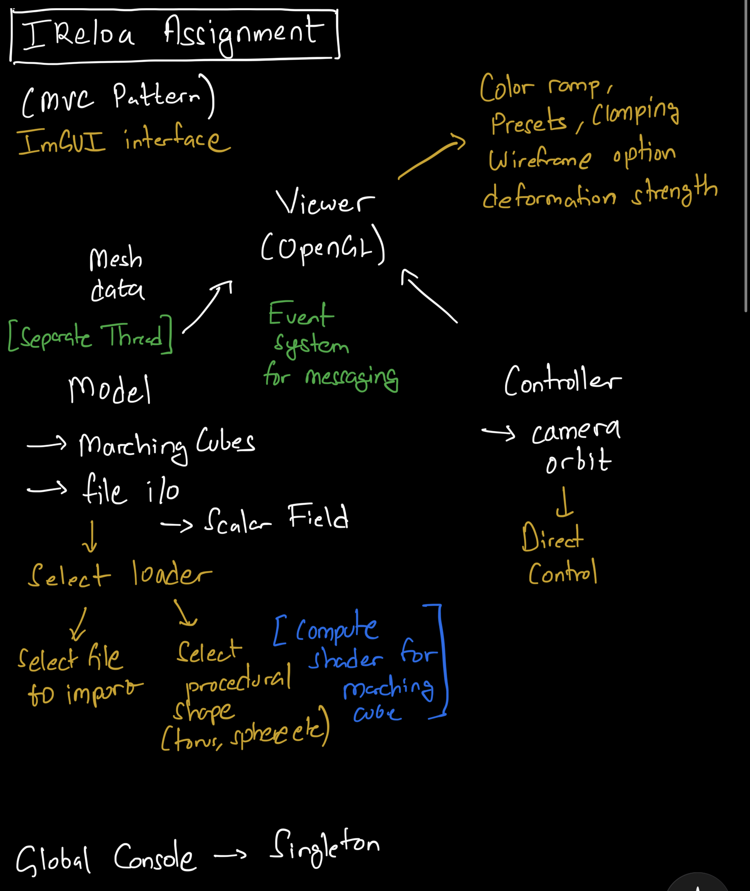

# Scientific Field Visualizer

A real-time GPU-accelerated scientific visualization tool built with C++ and OpenGL. 
Renders scalar and vector fields over procedural 3D meshes generated via Marching Cubes and Compute Shaders.

*The GIF may take some time to load:*


---

## Features

### Core
- [x] Procedural mesh generation via Marching Cubes (CPU + GPU compute shader). I chose this approach as I thought it was a good opportunity to demonstrate compute shaders as well. The current architecture can easily allow to add a file importer and render without much change.
- [x] Per-vertex scalar field visualization with analytical colormap implementation
- [x] Orbital camera — left drag to orbit, right drag to pan, scroll to zoom
- [x] Lambertian diffuse shading with per-vertex normals. Smooth normals would have been ideal but has been skipped for now in interest of time.

### Level 2
- [x] Colormap selector — Viridis, Jet, Plasma, etc (analytical, no texture lookups)
- [x] Wireframe overlay toggle — barycentric coordinate method, no second draw call
- [x] Scalar range control — interactive min/max clamping with out-of-range clamped to colormap extremes

### Level 3
- [x] Displacement / deformation overlay — per-vertex vector field, GPU deformation in vertex shader
- [x] Isoline rendering — fragment shader contour lines using fwidth for screen-consistent width
- [x] GPU Compute Shader — Marching Cubes runs entirely on GPU via compute shader, output written directly to SSBO bound as VBO (zero CPU readback)

---

## Build & Run

### Quick Start (Windows)
A precompiled `.exe` is available in [Releases](https://github.com/AmoghJ/your-repo/releases).  
Download and run — no installation required.

### Build from Source

**Prerequisites:**
- Visual Studio 2022
- [vcpkg](https://github.com/microsoft/vcpkg)

**Install dependencies via vcpkg:**
```bash
vcpkg install glm imgui[docking-experimental,glfw-binding,opengl3-binding] glew glfw3
```

**Build:**
1. Clone the repository
```bash
git clone https://github.com/AmoghJ/your-repo.git
cd your-repo
```
2. Open `ScientificVisualizer.sln` in Visual Studio 2022
3. Set vcpkg toolchain in project properties if not auto-detected
4. Build → Release x64
5. Run

**Controls:**

| Input | Action |
|-------|--------|
| Left drag | Orbit camera |
| Right drag | Pan camera |
| Scroll | Zoom |

---

## Architecture

The renderer uses a component-based architecture with an event/messaging system 
for decoupled communication between modules.

Before starting a project, I usually start with a sketch and figure out how all the modules will be pieced together. Overall, I spent around an hour thinking about the architecture before beginning development for this project.



**Key systems:**
- `MarchingCubes` — procedural mesh generation, CPU and GPU paths
- `OpenGLViewer` — FBO-based render-to-texture, displayed via ImGui
- `OrbitCamera` — spherical coordinate camera with MVP rebuild on viewport resize
- Compute shader pipeline — SSBO output bound directly as VBO, zero CPU readback

This architecture ensures that new features can be easily added without breaking anything. It makes it super easy to debug problems as they are local and there aren't much dependencies that are across the project. For e.g - it was really easy to add particle advection on top even though I hadn't planned for it initially.

---

## LLM Usage

I used Anthropic's Claude to have conversations and help in navigating some aspects of the projects. With chatbots, my workflow has changed from going to stackoverflow / or the documentation, to directly asking the chatbot. This has saved a lot of time browsing for the right function for the task. It helps tremendously in debugging as well since graphics programming has a lot of lines that require hardcoded values. A single incorrect digit and the whole program doesn't run without throwing an error. These are very difficult to catch, fortunately now chatbots are very effective at catching these.

It also helps to learn new concepts quickly. Eearlier I would have gone on forums to understanda topic - For e.g. I didn't know about the barycentric coordinates trick to render wireframe. But once the AI showed me, I immediately realised how easy and effective it is. What would have probably taken me an hour (most of the time just spent on searching the right information), now takes minutes (the concept is simple to understand).

In my experience, AI is very good at small context related tasks (I used it to generate the orbit camera class, functions for shape generators, scalar fields etc), but lack insight when it comes to large architecture decisions. In the beginning, I had a chat asking if in the context of the assignment, a MVC pattern with a container system would be good? Its reply was that it would be an overkill for the assignment. It thought that I would end up fighting the system rather than developing useful features. However, given the incremental nature of features to be implemented and the complexity of graphics related tasks, my experience told me that a robust architecture in the beginning saves a lot of time debugging and mass confusion later. I decided to stick with my architectural plan and it helped me a lot throughout the project.

**Overall, I think one needs a good idea about what the generic things are (such as camera orbiting, transfer functions etc) - where the AI probably has a lot of data that it is trained on, as opposed to specific things where the AI is more likely to misjudge and human judgement becomes necessary.**

---

## What I Would Do Differently

1. Smooth normals for marching cubes output would require building a vertex adjacency structure — mapping each unique position to all triangle faces that share it, then averaging their face normals. In interest of time I used face normals, which accurately represent the discrete mesh structure. A production implementation would use a hash map keyed on vertex position to accumulate and normalize shared normals in a post-process pass.

2. Grabbing input from ImGui is not ideal - right now the mouse input is being grabbed from openglviewer and sent to camera, the camera again sends updated info back. Ideally would implement a dedicated input handling system that is cross-platform.

3. Many hardcoded values for uniforms inside the shaders. A lot more values can be exposed through the GUI, but intentionally kept it lean for the assignment.

4. IModelData inheriting from component - this is basically so that each model can notify the container that it is done loading the model. I would have implemented a callback within modeldata to signal syncing of geometry.

5. Small optimization - esp. for push_back into std::vector -> too many copies and allocations. Ideally would want one allocation and no copies when generating geometry on cpu. This was partly ommitted by using compute shaders that directly allocate memory on GPU.

6. Anti-aliasing features to better display isolines and wireframes.

7. Normal coordinate space when applying transformations to mesh (currently they are in object space), I skipped this for now since mesh is not transforming. Ideally would setup a scene hierarchy structure with the ability to have parent-child relationship. Internally, the transformations matrices would be applied accordingly and the normals will be transformed to world space.

8. Need better way of sending vbo pointers to model class from render class. I modified the component, container event handling to have non-const value but this is not ideal as it may break things elsewhere.

9. OpenGLViewer and AdvectionViewer are largely the same classes. I hadn't planned on implementing advection earlier. But there should be an abstract class for the common functionality, and then the derived specialized classes for these viewers (Just like the model). Right now, I have just copy pasted code in interest of time.

---

## Dependencies

- [OpenGL 4.3+](https://www.opengl.org/)
- [GLFW](https://www.glfw.org/)
- [GLEW](http://glew.sourceforge.net/)
- [GLM](https://github.com/g-truc/glm)
- [Dear ImGui](https://github.com/ocornut/imgui) (docking branch)